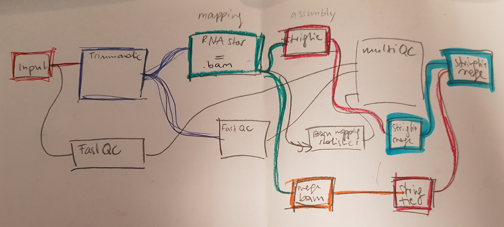

### Analysis pipeline for RNAseq 
#### Cichlid jaws 2020

##### 1. [Trimmomatic](http://www.usadellab.org/cms/?page=trimmomatic) (Server v0.36 or v0.39) [manual](http://www.usadellab.org/cms/uploads/supplementary/Trimmomatic/TrimmomaticManual_V0.32.pdf)

Trimmomatic on the Server (v.0.39) 

Do not forget to load TruSeq3-PE-2.fa in your cwd!!

```{bash eval = FALSE}
#
#$ -N trimmomatic       # Job name
#$ -S /bin/bash         # Set shell to bash
#
#$ -l h_vmem=2G         # Request Max. Virt. Mem.
#
#$ -cwd                 # Change to current working directory
#$ -V                   # Export environment variables into script
#$ -pe smp 4    # Select the parallel environment
#
#$ -o log.$JOB_NAME.$JOB_ID.out      # SGE-Output File
#$ -e log.$JOB_NAME.$JOB_ID.err      # SGE-Error File

#print some info to log
echo "Running under shell '${SHELL}' in directory '`pwd`' using $NSLOTS slots"
echo "Host: $HOSTNAME"
echo "Job: $JOB_ID"

#get going
echo -e "\n$(date)\n"

########### Change '-N' jobname, '-l h_vmem=' (storage), '-pe smp #' (number of cores)
########### trimm adapters and drop reads shorter than 70 bp

for i in `cat samples_A.txt`;

do

java -jar /usr/people/EDVZ/duenser/tools/Trimmomatic-0.39/trimmomatic-0.39.jar PE \
/cl_tmp/singh_duenser/all_adult/$i".1.fq" \
/cl_tmp/singh_duenser/all_adult/$i".2.fq" \
/cl_tmp/singh_duenser/bam_files/all_adult/LV_analysis/$i".1.paired.fq.gz" \
/cl_tmp/singh_duenser/bam_files/all_adult/LV_analysis/$i".1.unpaired.fq.gz" \
/cl_tmp/singh_duenser/bam_files/all_adult/LV_analysis/$i".2.paired.fq.gz" \
/cl_tmp/singh_duenser/bam_files/all_adult/LV_analysis/$i".2.unpaired.fq.gz" \
ILLUMINACLIP:TruSeq3-PE-2.fa:2:30:10:8:keepBothReads SLIDINGWINDOW:4:28 MINLEN:70

echo -e "\n$(date)\n"

done

```

or better (to genereate a job per file: (Poojas script))

1_trim.sh:
```{bash eval=FALSE}
#!/bin/bash

#pooja.singh09@gmail.com
#stage 26 samples all 3 lakes
# NB copy TrueSeq3-PE-2.fa to cwd

########### trimm adapters and drop reads shorter than 70 bp

for i in `cat all.adults.lab5 | grep .1.fq | cut -f -4 -d"."`;

do


qsub -q all.q -b y -cwd -N trim -l h_vmem=4G -pe smp 8 -o $i".trim.log" -e $i".trim.err" \
/usr/bin/java -jar /cl_tmp/singh_duenser/tools/Trimmomatic-0.39/trimmomatic-0.39.jar PE -threads 8 \
/cl_tmp/singh_duenser/all_adult/$i".1.fq" \
/cl_tmp/singh_duenser/all_adult/$i".2.fq" \
/cl_tmp/singh_duenser/all_adult/trimmomatic/$i".1.paired.fq.gz" \
/cl_tmp/singh_duenser/all_adult/trimmomatic/$i".1.unpaired.fq.gz" \
/cl_tmp/singh_duenser/all_adult/trimmomatic/$i".2.paired.fq.gz" \
/cl_tmp/singh_duenser/all_adult/trimmomatic/$i".2.unpaired.fq.gz" \
ILLUMINACLIP:TruSeq3-PE-2.fa:2:30:10:8:keepBothReads SLIDINGWINDOW:4:28 MINLEN:70 &

done

```


##### 2. RNAStar (Server 2.7.3.a)

[RNAStar](https://github.com/alexdobin/STAR) is an RNAseq-aligner 

We still ned to [decide](https://github.com/alexdobin/STAR/blob/master/doc/STARmanual.pdf):
- if we should include the 2-pass mode or not: no we do not use it (16.03.2020)
as it will add more noise than info (igv screening/sashimi plot)

Reference genome:	O_niloticus_UMD_NMBU

2_assembly_STAR.sh:
```{bash eval = FALSE}
#!/bin/bash

#pooja.singh09@gmail.com
#RNA star assembles reads into transcriptsusing a reference genome guide
#March 2020
########### Change '-N' jobname, '-l h_vmem=' (storage), '-pe smp #' (number of cores)
########### mapping to reference O. niloticus reference genome with 5 bioreprs per species per jaw


for i in `cat starinputfiles2`;

do

qsub -q all.q -pe smp 8 -l h_vmem=4G -cwd -V -N $i".STAR" -e $i".STAR.err" -o $i".STAR.log" -b y STAR --runThreadN 8 \
 --genomeDir /cl_tmp/singh_duenser/reference \
 --readFilesCommand gunzip -c \
 --readFilesIn ./trimmomatic/$i".1.paired.fq.gz" ./trimmomatic/$i".2.paired.fq.gz" \
 --outSAMtype BAM SortedByCoordinate \
 --twopassMode None \
 --outFileNamePrefix ./star_assembly/$i"." \
 --quantMode GeneCounts \
 --outSAMstrandField intronMotif \
 --outSAMattrIHstart 1 \
 --outSAMattributes NH HI AS nM NM MD MC jM jI ch XS \
 --outSAMprimaryFlag OneBestScore \
 --outSAMmapqUnique 60 \
 --outSAMunmapped Within  \
 --outFilterIntronStrands RemoveInconsistentStrands \
 --outBAMsortingBinsN 50  \
 --limitBAMsortRAM 4000000000 &

done

```


##### 3. [FastQC](https://www.bioinformatics.babraham.ac.uk/projects/fastqc/INSTALL.txt) (Galaxy Version 0.71) (Server v0.11.8)

Run FastQC before and after trimming:

3_fastqc_raw.sh:
```{bash eval = FALSE}
#!bin/bash

# anna.duenser@gmail.com
# fastqc
# March 2020
########### Change '-N' jobname, '-l h_vmem=' (storage), '-pe smp #' (number of cores)
########### fastqc of untrimmed reads

for i in `cat samples_fastqc.txt`;

do

qsub -q all.q -pe smp 8 -l h_vmem=4G -cwd -V -N $i".fastqc" -o ./fastqc/"log."$i".fastqc.out" -e ./fastqc"log."$i".fastqc.err" -b y fastqc -t 12 \
-o /cl_tmp/singh_duenser/all_adult/fastqc /cl_tmp/singh_duenser/all_adult/$i".fq" &

done

```


3_1_fastqc_trimed.sh:
```{bash}
#!bin/bash

# anna.duenser@gmail.com
# fastqc on trimmed reads
# March 2020
########### Change '-N' jobname, '-l h_vmem=' (storage), '-pe smp #' (number of cores)
########### fastqc of trimmed reads


for i in `cat samples_fastqc_trim.txt`;

do

qsub -q all.q -pe smp 8 -l h_vmem=4G -cwd -V -N $i".fastqc" -o ./trimmomatic/fastqc"log."$i".fastqc.out" -e ./trimmomatic/fastqc"log."$i".fastqc.err" -b y fastqc -t 12 \
-o /cl_tmp/singh_duenser/all_adult/trimmomatic/fastqc /cl_tmp/singh_duenser/all_adult/trimmomatic/$i".paired.fq.gz" &

done

```


##### 4. BAM mapping statistics

4_samtools_idxstats.sh:
```{bash eval = FALSE}
#!bin/bash

# anna.duenser@gmail.com
# samtool idxstats - .bam mapping statistics
# March 2020
########### Change '-N' jobname, '-l h_vmem=' (storage), '-pe smp #' (number of cores)
########### samtools idxstats

for i in `cat samples_samtools_idx.txt`;


do

qsub -q all.q -pe smp 8 -l h_vmem=4G -cwd -V -N $i".idxstat" -o ./star_assembly/$i".idxstat.out" -e ./star_assembly/$i".samtools_idx.err" -b y samtools idxstats --threads 12 \
 /cl_tmp/singh_duenser/all_adult/star_assembly/$i".Aligned.sortedByCoord.out.bam" &

done

```


##### 5. [MultiQC](https://multiqc.info/docs/) (Server v1.8.dev0)

Add flag `--interactive` to generate interactive multiqc page to be able to identify single samples. Include fastqc before and after trimming, .bam files from RNAstar and the samtools idxstats.

5_multiqc.sh:
```{bash eval = FALSE}
#!/bin/bash

# anna.duenser@gmail.com
# March 2020
# multiqc
#### input: fastqc from initial .fq files, fastqc files after trimmomatic, mapped .bam files
FILE_DIR="/cl_tmp/singh_duenser/all_st26"

qsub -q all.q -b y -cwd -N multiqc -l h_vmem=4G -pe smp 8 -o "log.multiqc.out" -e "log.multiqc.err" /usr/people/EDVZ/duenser/.local/bin/multiqc \
--interactive $FILE_DIR/fastqc_raw/ $FILE_DIR/trimmomatic/fastqc/ $FILE_DIR/star_assembly/
```


#### 6. Rename (larval) .bam files:

to ad an `.L.` to the name for further analysis 
6_rename_bam.sh:
```{bash}
#!bin/bash

# anna.duenser@gmail.com
# April 2020
# rename larvae and put a ".L." in the name

FILE_DIR="/cl_tmp/singh_duenser/all_st26/star_assembly"

# loop through .bam files
for i in `ls $FILE_DIR/*.bam | cut -d "/" -f 6`;

do
# cut only first part off
FIRST="$(echo $i | cut -d '.' -f 1)"
# cut the rest of needed name of
LAST="$(echo $i | cut -d '.' -f 2-3)"
# create new name
NEW_NAME=$FIRST".L."$LAST".bam"

mv $FILE_DIR/$i $FILE_DIR/$NEW_NAME

done

```


- Essentially the single .bam files created by RNA STAR are assembled with stringtie and then merged to one .gtf file
- Simmulatniously the single .bam files created by STAR are merged into one .bam file and then assembled with stringtie
- Finally the two generated .gtf files are merged with stringtie to create the final .gtf file

```{r echo = TRUE, fig.cap = "Fig.2: Galaxy workflow for the assembly", echo = TRUE}

```


#### 7. Merge BAM files (Server picard Version v2.21.7)

[picard](https://github.com/broadinstitute/picard) Version 2.21.7

if you get an error that you run out of threads (VM) you can specify the memory used by picard adding the `-Xmx4g` [flag](https://github.com/broadinstitute/picard/issues/1221)

picard.sh: example for one species and one tissue
```{bash eval = FALSE}
qsub -pe mpi 10 -l h_vmem=10G -b y -cwd -N picard -e picard.Ps.A.PJ.error -o picard.Ps.A.PJ.out \
java -Dpicard.useLegacyParser=false -jar -Xmx4g /usr/people/EDVZ/duenser/tools/picard.jar MergeSamFiles \
-I Ps.A.PJ.1.bam -I Ps.A.PJ.2.bam -I Ps.A.PJ.4.bam -I Ps.A.PJ.5.bam -I Ps.A.PJ.7.bam -O Ps.A.PJ.merged_files.bam -MSD=true \
-VALIDATION_STRINGENCY=LENIENT

echo -e "\n$(date)\n"
```

7_picard.sh:
```{bash eval = FALSE}
#!bin/bash

# anna.duenser@gmail.com
# March 2020
# picard
## merge single .bam files

FILE_DIR="/cl_tmp/singh_duenser/all_st26/star_assembly"
# define temp files
COUNTER=0
LAST=""
FULL=""

# loop whole folder and cut path
for i in `ls $FILE_DIR/*.bam | cut -d "/" -f 6`;
do

# for sanity check we need to remove numbering
SANITY="$(echo $i | cut -d'.' -f1-3)"

# counter is only needed for first loop, because $LAST is not defined
COUNTER=$[COUNTER + 1]

if [[ "$SANITY" != "$LAST" && "$COUNTER" != 1 ]]; 
then
echo "######"
echo $LAST
echo $FULL

qsub -pe mpi 10 -l h_vmem=10G -b y -cwd -N picard -e ./merged_bam_files/"picard."$LAST".err" -o ./merged_bam_files/"picard."$LAST".out" \
java -Dpicard.useLegacyParser=false -jar -Xmx2g /usr/people/EDVZ/duenser/tools/picard.jar MergeSamFiles \
$FULL \
-O ./merged_bam_files/$LAST".merged_files.bam" -MSD=true \
-VALIDATION_STRINGENCY=LENIENT

# reset string
FULL=""

# wait before submitting next job

sleep 10

fi

LAST=$SANITY
# build Input string
TMP="-I "$FILE_DIR/$i
FULL=$FULL" "$TMP

done

echo "#######"
echo $LAST
echo $FULL
echo "END"

# we need to submit the last loop result here

qsub -pe mpi 10 -l h_vmem=10G -b y -cwd -N picard -e ./merged_bam_files/"picard."$LAST".err" -o ./merged_bam_files/"picard."$LAST".out" \
java -Dpicard.useLegacyParser=false -jar -Xmx2g /usr/people/EDVZ/duenser/tools/picard.jar MergeSamFiles \
$FULL \
-O ./merged_bam_files/$LAST".merged_files.bam" -MSD=true -VALIDATION_STRINGENCY=LENIENT

```


##### 8. [StringTie](http://ccb.jhu.edu/software/stringtie/) (Server v.2.0.6)

input single mapped reads

8_stringtie_single.sh:
```{bash eval = FALSE}
#!bin/bash

# anna.duenser@gmail.com
# March 2020
# picard
## run stringtie on single files

FILE_DIR="/cl_tmp/singh_duenser/all_adult/star_assembly"


for i in `ls $FILE_DIR/*.bam | cut -d "/" -f 6`;

do

S_NAME="$(echo $i | cut -d'.' -f1-4)"

qsub -pe mpi 10 -l h_vmem=10G -b y -cwd -N "stringtie."$S_NAME -e ./stringtie_single/$S_NAME".stringtie.single.err" -o ./stringtie_single/$S_NAME".stringtie.single.out" \
/usr/people/EDVZ/duenser/tools/stringtie-2.0.6.Linux_x86_64/stringtie \
$FILE_DIR/$i --rf -f 0.15 -m 200 -a 10 -j 1 -c 2 -g 50 -M 0.95 -o ./stringtie_single/$S_NAME".gtf" &

sleep 2

done
```


#### 9. [StringTie](http://ccb.jhu.edu/software/stringtie/) (Server v.2.0.6) 
input merged bam files

9_stringtie_merged_bam.sh:
```{bash}
#!bin/bash

# anna.duenser@gmail.com
# March 2020
# stringtie
## run stringtie on merged bam files = MergedBam

FILE_DIR="/cl_tmp/singh_duenser/all_adult"


for i in `ls $FILE_DIR/merged_bam_files/*.bam | cut -d "/" -f 6`;

do

S_NAME="$(echo $i | cut -d'.' -f1-3)"


qsub -pe mpi 10 -l h_vmem=10G -b y -cwd -N "stringtieMB."$S_NAME -e ./stringtie_merged_bam/"stringtie_MergedBam."$S_NAME".err" \
-o ./stringtie_merged_bam/"stringtie_MergedBam."$S_NAME".out" \
/usr/people/EDVZ/duenser/tools/stringtie-2.0.6.Linux_x86_64/stringtie \
$FILE_DIR/merged_bam_files/$i --rf -f 0.15 -m 200 -a 10 -j 1 -c 2 -g 50 -M 0.95 -o ./stringtie_merged_bam/$S_NAME".MergedBam.gtf" &

sleep 1

done

```


##### 10. StringTie merge (Server v.2.0.6)

- Stringtie provides a merge command to combine predicted transcript GTF files from across different libraries
- Once you have a merged GTF file you can run Stringtie again with this instead of the known transcripts GTF file we used above
- Stringtie also provides 'gffcompare' to compare predicted transcripts to known transcripts
- Refer to the [Stringtie manual](https://ccb.jhu.edu/software/stringtie/index.shtml?t=manual) for a more detailed explanation


merge biological replicate .gtf files from step 8. per species and tissue

```{bash eval = FALSE}
stringtie --merge -F 1.0 -T 1.0 /cl_tmp/singh_duenser/bam_files/all_adult/LV_analysis/annotations/Gh.A.OJ.*.gtf \
 -o /cl_tmp/singh_duenser/bam_files/all_adult/LV_analysis/annotations/stringtiemerge.Gh.A.OJ.gtf
stringtie --merge -F 1.0 -T 1.0 /cl_tmp/singh_duenser/bam_files/all_adult/LV_analysis/annotations/Gh.A.PJ.*.gtf \
 -o /cl_tmp/singh_duenser/bam_files/all_adult/LV_analysis/annotations/stringtiemerge.Gh.A.PJ.gtf
 #...
```

or

10_stringtieMerge_single.sh
```{bash}
 #!bin/bash

# anna.duenser@gmail.com
# March 2020
# stringtie --merge
## merge single .gtf files for each species

FILE_DIR="/cl_tmp/singh_duenser/all_adult/stringtie_single"


for i in `ls $FILE_DIR/*.1.gtf | cut -d "/" -f 6 | cut -d'.' -f1-3`;

do

qsub -pe mpi 10 -l h_vmem=10G -b y -cwd -N "stringtieMmerge."$i -e $FILE_DIR/stringtieMerge_single/"stringtieM."$i".err" \
-o $FILE_DIR/stringtieMerge_single/"stringtieM."$i".out" \
/usr/people/EDVZ/duenser/tools/stringtie-2.0.6.Linux_x86_64/stringtie --merge \
-F 1.0 -T 1.0 $FILE_DIR/$i"."*".gtf" \
-o $FILE_DIR/stringtieMerge_single/"stringtieMerge_single."$i".gtf" &

sleep 1


done

```


##### 11. StringTie merge (Server v.2.0.6) 

merge all .gtf files from step 9. and step 10. per species and tissue

11_merge_all_gtf.sh
```{bash eval = FALSE}
#!bin/bash
#poojasingh
#aug2020
#merging gtfs originating from single .bam files (and then merged) and the ones from merged .bam files
#merged for OJ and PJ separately for comparison and then OJ and PJ will be merged for final output
#the reason for this is that I want to compare the number of transcripts assmbled for OJ and PJ too
# I also merged all samples at once versus first merging OJ and PJ, just to see if there was a difference
# I find more trancripts when I merged OJ and PJ separately than when I merge all (77k versus 84k)


FILE_DIR="/cl_tmp/singh_duenser/all_st26"


#OJ (69519 transcripts)
qsub -pe mpi 10 -l h_vmem=10G -b y -cwd -N all_gtf_mergeOJ \
-e $FILE_DIR/all_gtf_merged/all_gtf.OJerr -o $FILE_DIR/all_gtf_merged/all_gtf.OJ.out \
/usr/people/EDVZ/duenser/tools/stringtie-2.0.6.Linux_x86_64/stringtie --merge -F 1.0 -T 1.0 \
$FILE_DIR/stringtie_single/stringtieMerge_single/stringtieMerge_single.*.OJ.gtf \
$FILE_DIR/stringtie_merged_bam/*.OJ.MergedBam.gtf \
-p 10 -o $FILE_DIR/all_gtf_merged/all_gtf_merged.OJ.gtf 

sleep 1

#PJ (67057 transcripts)
qsub -pe mpi 10 -l h_vmem=10G -b y -cwd -N all_gtf_mergePJ \
-e $FILE_DIR/all_gtf_merged/all_gtf.PJerr -o $FILE_DIR/all_gtf_merged/all_gtf.PJout \
/usr/people/EDVZ/duenser/tools/stringtie-2.0.6.Linux_x86_64/stringtie --merge -F 1.0 -T 1.0 \
$FILE_DIR/stringtie_single/stringtieMerge_single/stringtieMerge_single.*.PJ.gtf \
$FILE_DIR/stringtie_merged_bam/*.PJ.MergedBam.gtf \
-p 10 -o $FILE_DIR/all_gtf_merged/all_gtf_merged.PJ.gtf

sleep 1

#both (84k)

qsub -pe mpi 10 -l h_vmem=10G -b y -cwd -N all_gtf_merge \
-e $FILE_DIR/all_gtf_merged/all_gtf.err -o $FILE_DIR/all_gtf_merged/all_gtf.out \
/usr/people/EDVZ/duenser/tools/stringtie-2.0.6.Linux_x86_64/stringtie --merge -F 1.0 -T 1.0 \
$FILE_DIR/all_gtf_merged/all_gtf_merged.OJ.gtf \
$FILE_DIR/all_gtf_merged/all_gtf_merged.PJ.gtf \
-p 10 -o $FILE_DIR/all_gtf_merged/all_gtf_merged.OJPJ.gtf

#all (77k)

qsub -pe mpi 10 -l h_vmem=10G -b y -cwd -N all_gtf_merge \
-e $FILE_DIR/all_gtf_merged/all_gtf.err -o $FILE_DIR/all_gtf_merged/all_gtf.out \
/usr/people/EDVZ/duenser/tools/stringtie-2.0.6.Linux_x86_64/stringtie --merge -F 1.0 -T 1.0 \
$FILE_DIR/stringtie_single/stringtieMerge_single/stringtieMerge_single.*.gtf \
$FILE_DIR/stringtie_merged_bam/*.MergedBam.gtf \
-p 10 -o $FILE_DIR/all_gtf_merged/all_gtf_merged.all.gtf


```


##### 12. Annotation using gffcompare
[gffcompare](https://ccb.jhu.edu/software/stringtie/gffcompare.shtml) v0.11.2

The program gffcompare can be used to compare, merge, annotate and estimate accuracy of one or more GFF files (the “query” files), when compared with a reference annotation (also provided as GFF).

Note: the .refmap and .tmap output files described below are created for each query `<input_file>' given, in the same directories where those input files reside.
12_gffcmp.sh
```{bash eval=FALSE}
#!bin/bash

# anna.duenser@gmail.com
# April 2020
# gffcompare
## annotate .gtf files

# -r comparing with a reference annotation - will produce class codes: https://ccb.jhu.edu/software/stringtie/gffcompare.shtml
# -e Maximum distance (range) allowed from free ends of terminal exons of reference transcripts when assessing exon accuracy. By default, this is 100.
# -d Maximum distance (range) for grouping transcript start sites, by default 100.

FILE_DIR="/cl_tmp/singh_duenser/all_LV"

# all single gtf files merged at once

# qsub -pe mpi 10 -l h_vmem=10G -b y -cwd -N gffcmp.single \
# -e $FILE_DIR/gffcompare/gffcmp.LV.single_gtf.err -o $FILE_DIR/gffcompare/gffcmp.LV.single_gtf.out \
# /usr/people/EDVZ/duenser/tools/gffcompare-0.11.2.Linux_x86_64/gffcompare -r /cl_tmp/singh_duenser/reference/O_niloticus_UMD_NMBU.99.gff3 -e 100 -d 100 \
# $FILE_DIR/stringtie_single/stringtieMerge_single.allLV.gtf -o $FILE_DIR/gffcompare/gffcmp.stringtieMerge_single.allLV


# gtf files from merged bam per species merged at once

# qsub -pe mpi 10 -l h_vmem=10G -b y -cwd -N gffcmp.MergedBAM \
# -e $FILE_DIR/gffcompare/gffcmp.LV.MergedBam_gtf.err -o $FILE_DIR/gffcompare/gffcmp.LV.MergedBam_gtf.out \
# /usr/people/EDVZ/duenser/tools/gffcompare-0.11.2.Linux_x86_64/gffcompare -r /cl_tmp/singh_duenser/reference/O_niloticus_UMD_NMBU.99.gff3 -e 100 -d 100 \
# $FILE_DIR/stringtie_MergedBam/stringtieMerge_MergedBam.allLV.gtf -o $FILE_DIR/gffcompare/gffcmp.stringtieMerge_MergedBam.allLV


# all bam files merged - one gtf

# qsub -pe mpi 10 -l h_vmem=10G -b y -cwd -N gffcmp.oneBam \
# -e $FILE_DIR/gffcompare/gffcmp.LV.oneBam.err -o $FILE_DIR/gffcompare/gffcmp.LV.oneBam.out \
# /usr/people/EDVZ/duenser/tools/gffcompare-0.11.2.Linux_x86_64/gffcompare -r /cl_tmp/singh_duenser/reference/O_niloticus_UMD_NMBU.99.gff3 -e 100 -d 100 \
# $FILE_DIR/stringtie_oneBam/ALL_LV.oneBam_stringtie.gtf -o $FILE_DIR/gffcompare/gffcmp.stringtieMerge_oneBam.allLV


# stepwise merging, species, jaw, ojpj, stages

qsub -pe mpi 10 -l h_vmem=10G -b y -cwd -N gffcmp.stepwise \
-e $FILE_DIR/gffcompare/gffcmp.LV.stepwise.err -o $FILE_DIR/gffcompare/gffcmp.LV.stepwise.out \
/usr/people/EDVZ/duenser/tools/gffcompare-0.11.2.Linux_x86_64/gffcompare -r /cl_tmp/singh_duenser/reference/O_niloticus_UMD_NMBU.99.gff3 -e 100 -d 100 \
$FILE_DIR/stringtie_stepwise/merged.LV.gtf -o $FILE_DIR/gffcompare/gffcmp.stringtieMerge_stepwise.allLV

```


#### 13. Filter class codes

Run this using # Rscript filter.R

13_filter_script.R
```{r eval=FALSE}
# Filter annotation.gtf files
# September 2020
# anna.duenser@gmail.com

FILE.DIR = "/cl_tmp/singh_duenser/all_LV/gffcompare" #!change this
setwd(FILE.DIR) 


#if (!requireNamespace("BiocManager", quietly = TRUE))
#  install.packages("BiocManager")
#BiocManager::install("rtracklayer")
install.packages("tidyverse", repos = 'https://cran.wu.ac.at/')
library(tidyverse)
install.packages("rtracklayer", repos = 'https://cran.wu.ac.at/')
library(rtracklayer)
library(dplyr)
library("BiocGenerics")


DATE <- format(Sys.time(), "%m%d%Y")

all.files <- list.files(FILE.DIR, full.names = FALSE)
gffcmp_files <- as.vector(grep("gffcmp.*annotated.gtf", all.files, value = TRUE))

my_log <- file(paste("log_filterscritp_R_", DATE, ".txt", sep = ""))
sink(my_log, append = TRUE, type = "output", split = TRUE)

filter_function <- function(filename_1){
  print("Loaded Files:")
  print(filename_1)
  l1 <- length(filename_1)
  print("Number of Files:")
  print(l1)
  
  for (i in filename_1){
    print("Filtering:")
    print(i)

    # import annotation file
    # import gffread file
    all <- import(i)
    all <- as_tibble(all)
    print("Imported Rows:")
    print(nrow(all))
    # filter all single exons not in the reference (class code "u")
    # filter class p"
    #  do not mess with the filtering steps. n() is needed to keep grouping alive a bit longer!
    
    # group by gene_id, to exclude genes that also include monoexonic isoforms and only 
    # filter monoexonic transcripts that ar not in the reference
    all_without_singleUexons <- all %>% group_by(gene_id) %>% filter(!(n() == 2 && class_code == "u"))
    print("Removed single exon with class_code 'u'")
    print(nrow(all_without_singleUexons)-nrow(all))
    
    # filter_o <- filtered_exons_introns %>% group_by(transcript_id) %>% filter(!(n() >= 2 && class_code == "o"))
    filter_p <- all_without_singleUexons %>% group_by(transcript_id) %>% filter(!(n() >= 2 && class_code == "p"))
    print("Removed transcripts with class_code 'p'")
    print(nrow(filter_p)-nrow(all))
    
    filename <- paste("filtered.", i, sep = "")
    print("Saving")
    print(filename)
    export(filter_p, filename, format="GTF")
    print(Sys.time())
  }
  return(TRUE)
}


filter_function(gffcmp_files)

sink()


##########################################################################################
quit(save="no")


```

use qsub to submit the job

13_filter_classcode_R.sge
```{bash eval = FALSE}
#
#$ -N filterR		# Job name
#$ -S /bin/bash         # Set shell to bash
#
#$ -l h_vmem=2G         # Request Max. Virt. Mem.
#
#$ -cwd                 # Change to current working directory
#$ -V                   # Export environment variables into script
#$ -pe smp 2    # Select the parallel environment
#
#$ -o log.$JOB_NAME.$JOB_ID.out      # SGE-Output File
#$ -e log.$JOB_NAME.$JOB_ID.err      # SGE-Error File

#print some info to log
echo "Running under shell '${SHELL}' in directory '`pwd`' using $NSLOTS slots"
echo "Host: $HOSTNAME"
echo "Job: $JOB_ID"

#get going
echo -e "\n$(date)\n"

# anna.duenser@gmail.com
# April 2020
# Rscript
## filtering the class codes


Rscript 15_filter_script.R

```


#### 14. gffcompare - gffread

14_1_gffcmp_gffread.sh
```{bash eval = FALSE}
#!bin/bash

# anna.duenser@gmail.com
# April 2020
# gffcompare
## annotate .gtf files

# -r comparing with a reference annotation - will produce class codes: https://ccb.jhu.edu/software/stringtie/gffcompare.shtml
# -e Maximum distance (range) allowed from free ends of terminal exons of reference transcripts when assessing exon accuracy. By default, this is 100.
# -d Maximum distance (range) for grouping transcript start sites, by default 100.

FILE_DIR="/cl_tmp/singh_duenser/all_LV/gffread"

# gffcompare filtered gtf file (after gffread you loose the class codes info

qsub -pe mpi 10 -l h_vmem=10G -b y -cwd -N gffcmp.fil.stepwise \
-e $FILE_DIR/gffcmp.LV.stepwise.err -o $FILE_DIR/gffcmp.LV.stepwise.out \
/usr/people/EDVZ/duenser/tools/gffcompare-0.11.2.Linux_x86_64/gffcompare -r /cl_tmp/singh_duenser/reference/O_niloticus_UMD_NMBU.99.gff3 -e 100 -d 100 \
$FILE_DIR/gffread.filtered.gffcmp.stringtieMerge_stepwise.allLV.annotated.gtf -o $FILE_DIR/filtered.gffread.gffcmp.allLV
```


#### 14. Filter max introns with gffread

we filtered out introns that were longer than the max introns of the reference (200000).

14_gffread_filtermaxintrons.sge
```{bash eval = FALSE}
# anna.duenser@gmail.com
# April 2020
# gffread
## use gffread to filter out introns longer than in the reference (200000)

FILE_DIR="/cl_tmp/singh_duenser/all_LV"

for i in `ls $FILE_DIR/gffcompare/filtered.*.annotated.gtf | cut -d "/" -f 6`;

do 

gffread $FILE_DIR/gffcompare/$i -o $FILE_DIR/gffread/"gffread."$i -i 200000 -T

done


```


#### 15. Stringtie

15_stringtie_all.sh
```{bash eval = FALSE}
#!bin/bash

# anna.duenser@gmail.com
# September 2020
# stringtie
## Run stringtie with the new annotations
# -M to reduce multimapping, -e to only allow transcripts in the filtered annotation file, --rf strand info, -B ballgown files

FILE_DIR_STAR_A="/cl_tmp/singh_duenser/all_adult/star_assembly"
FILE_DIR_STAR_L="/cl_tmp/singh_duenser/all_st26/star_assembly"
FILE_DIR_OUT="/cl_tmp/singh_duenser/all_LV/count_matrices"
FILE_DIR_ANNO="/cl_tmp/singh_duenser/all_LV/gffread"

for i in `cat samples_LV_A.txt`;
 
do

qsub -q all.q -pe smp 8 -l h_vmem=4G -cwd -V -N $i"stringtie.all" \
-o $FILE_DIR_OUT/"log.A.stringtie.all.out" -e $FILE_DIR_OUT/"log.A.stringtie.all.err" -b y \
/usr/people/EDVZ/duenser/tools/stringtie-2.0.6.Linux_x86_64/stringtie -M 0.0 -e -B -G \
$FILE_DIR_ANNO/filtered.gffread.gffcmp.allLV.annotated.gtf \
--rf  -o $FILE_DIR_OUT/$i/transcripts.gtf \
-A $FILE_DIR_OUT/$i/gene_abundance.tsv \
$FILE_DIR_STAR_A/$i".Aligned.sortedByCoord.out.bam"

sleep 1

done 

for i in `cat samples_LV_L.txt`;
 
do

qsub -q all.q -pe smp 8 -l h_vmem=4G -cwd -V -N $i"stringtie.all" \
-o $FILE_DIR_OUT/"log.L.stringtie.all.out" -e $FILE_DIR_OUT/"log.L.stringtie.all.err" -b y \
/usr/people/EDVZ/duenser/tools/stringtie-2.0.6.Linux_x86_64/stringtie -M 0.0 -e -B -G \
$FILE_DIR_ANNO/filtered.gffread.gffcmp.allLV.annotated.gtf \
--rf  -o $FILE_DIR_OUT/$i/transcripts.gtf \
-A $FILE_DIR_OUT/$i/gene_abundance.tsv \
$FILE_DIR_STAR_L/$i".bam"

sleep 1

done 

```

`-M 0.0` = no multimapping allowed

(step 16 and 17 were dead ends using ballgown)

#### 18. Rename gtf files

18_rename_gtf.sh
```{bash eval = FALSE}

for i in `cat samples_LV_all.txt`;

do

cp ./count_matrices/$i/"transcripts.gtf" ./count_matrices/$i/$i"_ref.gtf"

done
```


#### 19. Generate raw count matrices with [prepDE.py](http://ccb.jhu.edu/software/stringtie/dl/prepDE.py) (a script that comes with stringtie v2.0.6)

You need to specify the name of sample and the directory in a separate txt document:
```{bash eval = FALSE}
Gh.A.OJ.1	./count_matrices/Gh.A.OJ.1/Gh.A.OJ.1_ref.gtf
Gh.A.OJ.2	./count_matrices/Gh.A.OJ.2/Gh.A.OJ.2_ref.gtf
Gh.A.OJ.3	./count_matrices/Gh.A.OJ.3/Gh.A.OJ.3_ref.gtf
Gh.A.OJ.4	./count_matrices/Gh.A.OJ.4/Gh.A.OJ.4_ref.gtf
Gh.A.OJ.5	./count_matrices/Gh.A.OJ.5/Gh.A.OJ.5_ref.gtf
..
```


19_prepDE.sh
```{bash eval = FALSE}
#!bin/bash

# anna.duenser@gmail.com
# April 2020
# run prepDE.py

FILE_DIR="/cl_tmp/singh_duenser/all_LV/count_matrices"

qsub -q all.q -pe smp 12 -l h_vmem=4G -cwd -V -N prepDE_A \
-o $FILE_DIR/log.prepDE_A.out -e $FILE_DIR/log.prepDE_A.err -b y \
/usr/people/EDVZ/duenser/tools/stringtie-2.0.6.Linux_x86_64/prepDE.py -i $FILE_DIR/sample_prepDE_A.txt \
-g $FILE_DIR/gene_count_matrix_A.csv -t $FILE_DIR/transcript_count_matrix_A.csv  -l 125


qsub -q all.q -pe smp 12 -l h_vmem=4G -cwd -V -N prepDE_L \
-o $FILE_DIR/log.prepDE_L.out -e $FILE_DIR/log.prepDE_L.err -b y \
/usr/people/EDVZ/duenser/tools/stringtie-2.0.6.Linux_x86_64/prepDE.py -i $FILE_DIR/sample_prepDE_L.txt \
-g $FILE_DIR/gene_count_matrix_L.csv -t $FILE_DIR/transcript_count_matrix_L.csv  -l 125

echo -e "\n$(date)\n"
```


#### 20. Continue with DESeq2 for DEgene expression analysis and SUPPA2 for AS.


Future: 
Put this into a snakemake pipeline

Also include docker 
and singularity
